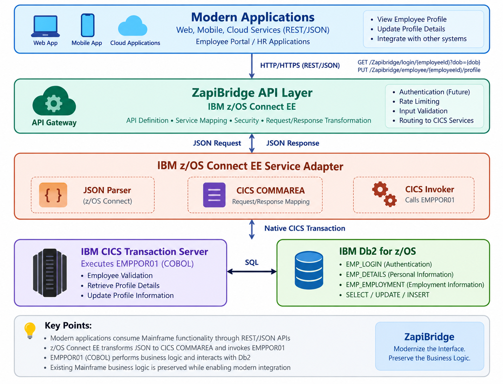

# 🔗 🌐 ZapiBridge | Mainframe Modernization Platform

  

## 📌 Executive Summary 

ZapiBridge modernizes an existing Mainframe application by exposing COBOL/CICS business logic and Db2 data as REST APIs using IBM z/OS Connect EE. The project demonstrates how modern web applications can interact with reliable Mainframe systems through REST/JSON interfaces while preserving the underlying COBOL business logic.

- 🎯 **Business Problem:** Mainframe applications contain critical business logic, but modern applications require REST/JSON interfaces. Integrating directly with CICS/COBOL applications can be complex, and rewriting established Mainframe systems can be costly and risky.
- 🛠️ **Approach:** Developed `EMPPOR01` using COBOL, CICS, and Db2; exposed the program through IBM z/OS Connect EE; and integrated the resulting APIs with a modern employee portal for profile retrieval and updates.
- 📊 **Business Impact:** Enabled modern REST-based access to Mainframe employee data, demonstrated a practical API-led modernization approach, preserved existing business logic, and created a reusable foundation for additional Mainframe APIs.

---

# 🚨 Business Problem

Organizations struggle to integrate mature mainframe systems with modern applications:

- Extended development cycles - New features require understanding decades-old COBOL code
- Integration bottlenecks - Modern apps cannot easily talk to mainframe services
- Operational silos - Mainframe and cloud teams work independently, causing misalignment
- The challenge: Leverage mainframe investments while modernizing the application layer.

---

# 🎯 Objective

1. Exposes CICS/COBOL logic through REST APIs (using IBM z/OS Connect EE)
2. Preserves existing Db2 data — no rewrites, no migration
3. Enables real-time integration between modern apps and legacy systems
4. Maintains zero disruption to existing operations

---

# 🏗️ Solution Architecture

## Key Components:

* API Gateway - Request routing, security, rate limiting
* z/OS Connect Adapters - Transform JSON ↔ CICS COMMAREA
* Legacy Integration - Direct CICS invocation, Db2 access
* Data Layer - Connection pooling, prepared statements, ACID compliance

---

# 📊 Application Flow:

1. Modern Web Apps ends REST request (JSON)
2. API Gateway validates & authenticates
3. z/OS Adapter transforms JSON → CICS COMMAREA
4. Mainframe processes (COBOL logic + Db2 queries)
5. Response returned as JSON to modern app

---

## 🛠️ Skills

### 💻 Mainframe Development

- COBOL Programming
- CICS Application Development
- CICS COMMAREA
- Embedded SQL
- JCL
- CICS Program Integration
- Mainframe Application Development
- Error Handling and Response Processing

### 🗄️ Database

- IBM Db2 for z/OS
- SQL (`SELECT`, `INSERT`, `UPDATE`)
- Db2 DDL & DML
- Table Design and Relationships
- Primary Key & Foreign Key Concepts
- Data Validation and Testing
- Multi-table SQL Joins
- Conditional SQL Updates

### 🔗 API & Integration

- IBM z/OS Connect EE
- REST API Development
- JSON Request / Response
- CICS Service Integration
- CICS COMMAREA Services
- Service Interface Definition
- API Request/Response Mapping
- JSON-to-COMMAREA Transformation
- API Testing with Swagger UI
- REST API Integration

### 🌐 Web Development

- HTML
- CSS
- JavaScript
- REST API Integration
- Frontend Form Handling
- Employee Profile Management
- API-driven User Interface
- Frontend-to-Mainframe Integration

### ⚙️ Tools & Environment

- IBM z/OS
- IBM CICS Transaction Server
- IBM Db2
- IBM z/OS Connect EE
- IBM Developer for z/OS
- 3270 / CICS Terminal
- Visual Studio Code
- Git
- GitHub
- Swagger UI
- Postman / REST Clients

---

## 📊 Results & Key Outcomes

The project demonstrates how an existing COBOL/CICS application can be integrated with modern applications through REST APIs while retaining the underlying Mainframe business logic and Db2 data.

### 🔍 Key Outcomes

- 🔗 **COBOL/CICS API Enablement:** Exposed the `EMPPOR01` COBOL/CICS application through IBM z/OS Connect EE, making Mainframe functionality accessible through REST APIs.

- 🗄️ **Db2 Integration:** Integrated the application with three Db2 tables — `EMP_LOGIN`, `EMP_DETAILS`, and `EMP_EMPLOYMENT` — to validate employees and retrieve profile and employment information.

- 🔄 **JSON ↔ COMMAREA Integration:** Established communication between modern REST/JSON requests and the CICS `DFHCOMMAREA` used by the COBOL application.

- 👤 **Employee Profile Retrieval:** Enabled modern applications to retrieve employee personal and employment information through a REST API.

- ✏️ **Profile Update Capability:** Implemented update processing for employee personal email, mobile number, emergency contact, and address while retaining existing values for fields that are not being changed.

- 🌐 **Modern Web Integration:** Created a foundation for connecting a modern web-based Employee Self-Service portal with Mainframe APIs.

- ♻️ **Business Logic Reuse:** Retained the existing COBOL/CICS business logic instead of replacing the Mainframe application with a new application stack.

### 💡 Modernization Benefits

- 🎯 **Reduced Rewrite Risk:** Existing COBOL business logic continues to run on CICS.

- 🔌 **API Accessibility:** Mainframe functionality can be consumed using standard REST/JSON interfaces.

- 🛡️ **Preserved Mainframe Investment:** Existing CICS and Db2 infrastructure remains part of the solution.

- 🚀 **Modern Application Integration:** Web applications can interact with Mainframe services without directly accessing CICS or Db2.

- 📈 **Extensible Architecture:** The same API enablement approach can be extended to additional COBOL/CICS business services.

---

**Status:** 🚧 Mainframe Modernization / Proof of Concept

**Core Application:** `EMPPOR01`

**API Platform:** IBM z/OS Connect EE

**Transaction Processing:** IBM CICS

**Database:** IBM Db2 for z/OS

**Integration:** REST / JSON ↔ CICS COMMAREA

**Source Control:** Git / GitHub

**Last Updated:** September 2026